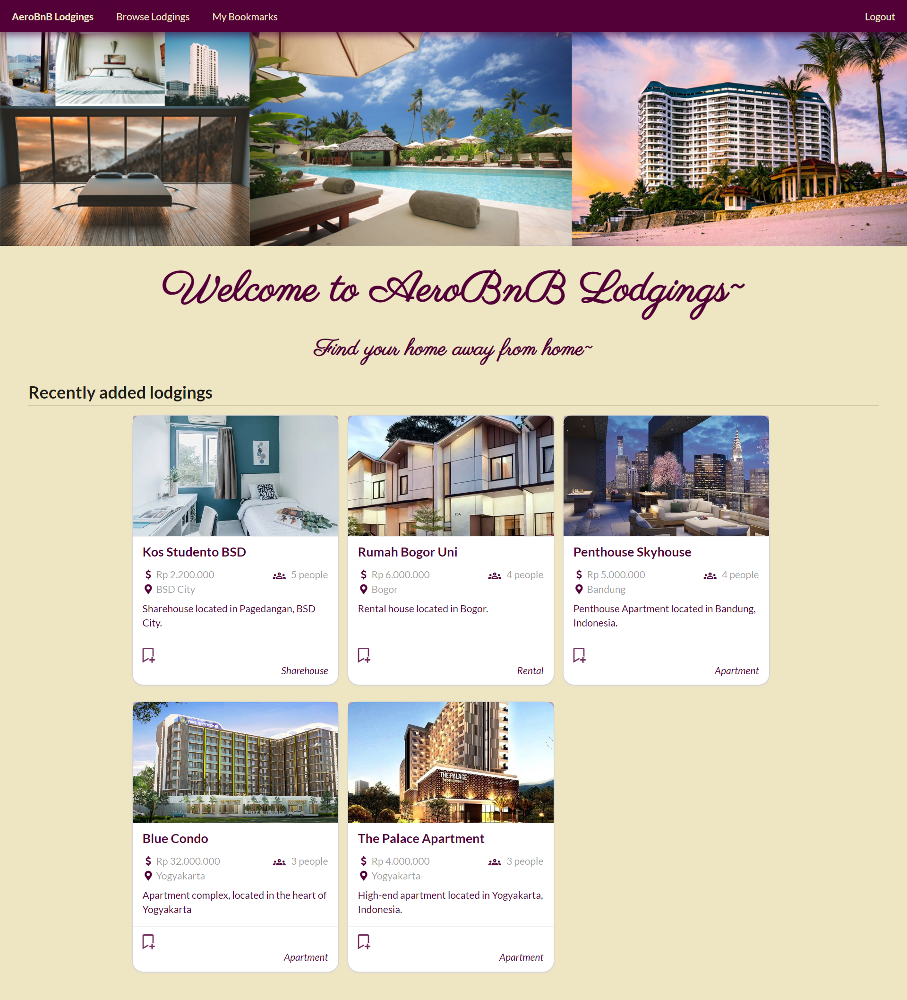
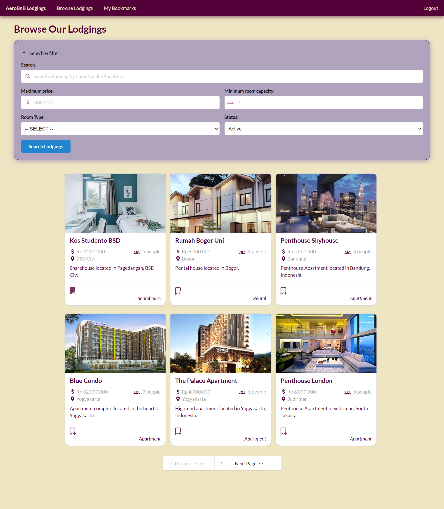
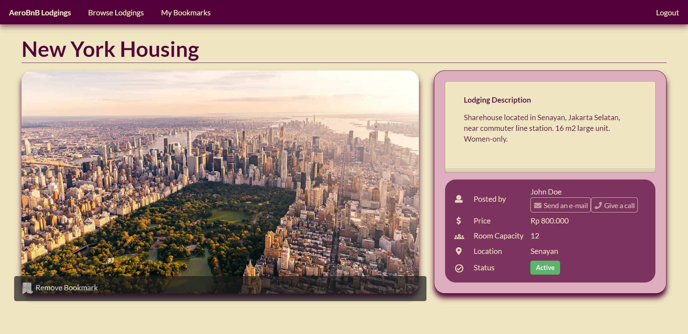
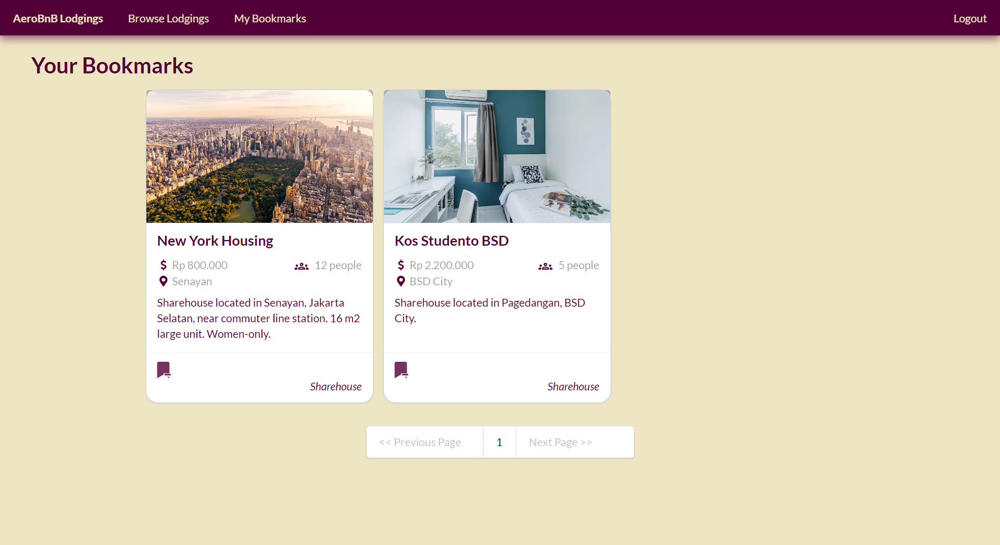

# Lodgings App

A full-stack web application for a lodgings rental platform.

Tech stack:
 - Vue.js
 - Pinia (State Management)
 - Semantic UI (CSS Library)
 - Node.js (Express) REST API with PostgreSQL Database
 - Axios
 - Vue Toast Notification

Main features:
 - OAuth user authentication
 - Social Media (Google) Login
 - Filter lodgings based on min. room capacity, lodging type, max. price, and posting status
 - Search lodgings based on title
 - Pagination
 - Save user bookmarks
 - CSS & layouting: Responsive Design

## Demo Screenshots

### Homepage

### List all lodgings

### User bookmarks

### Content Management System

