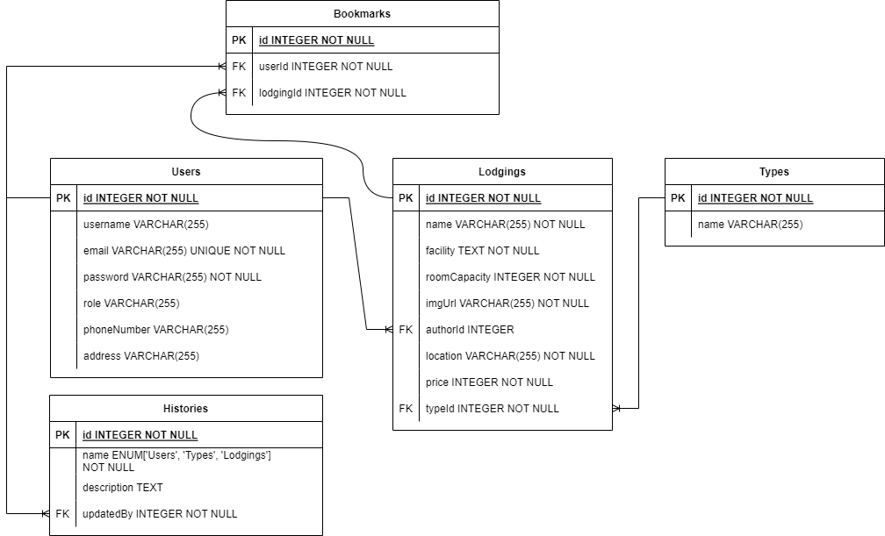

# Lodgings App

A RESTful API for a web application for a lodgings rental platform.

Serves data for an admin Content Management System and a public customer-facing website.

Main features include:
 - OAuth user authentication
 - Social Media (Google) Login
 - Filter lodgings based on min. room capacity, lodging type, max. price, and posting status
 - Search lodgings based on title
 - Pagination
 - Save user bookmarks

API Documentation (in Bahasa Indonesia only):
 - [Admin CMS](api-documentation-CMS.md)
 - [Customer-facing](api-documentation-Customer.md)

Front-end Application:
 - [Admin CSS](https://github.com/ValYauw/lodgings-app-client-admin)
 - [Customer-facing app](https://github.com/ValYauw/lodgings-app-client-user)

## How to run

```npm install```

Install packages and dependencies.

```bash dbsetup-sequelize.sh```

Migrates and seeds database in development and testing environments. [Requires sequelize-cli]

Database configuration options can be changed in `config/config.json`.

```npm start```

Start Node.js application.

```bash dbdrop-sequelize.sh```

Drops the database in development and testing environments. [Requires sequelize-cli]

```npm run test```

Run tests.

## Tech Stack

 - PostgreSQL Database
 - Express.js
 - ORM Sequelize
 - JSON Web Token (user authentication)
 - bcryptjs (password hashing)

### Third Party APIs

 - Google Authentication Library
 - [QR Code Generator Service](https://www.qr-code-generator.com/qr-code-api/)

## Database Schema

