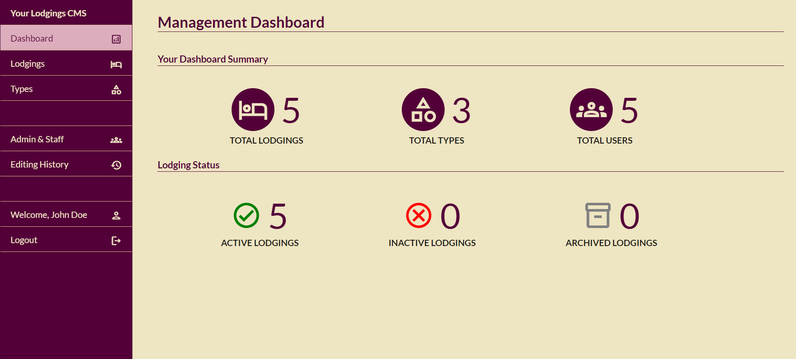
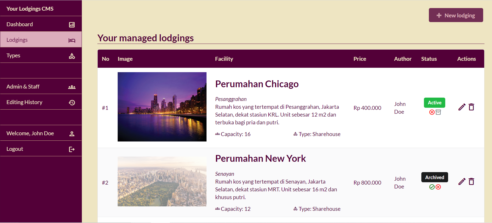
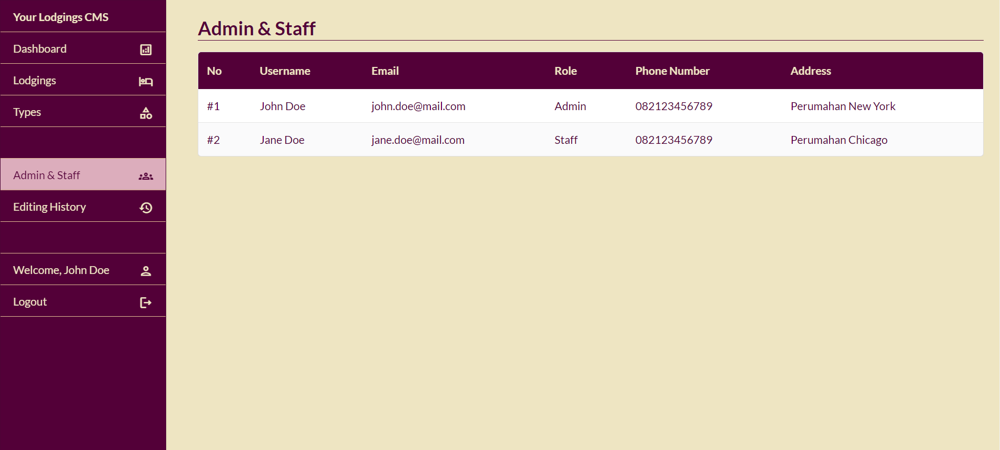
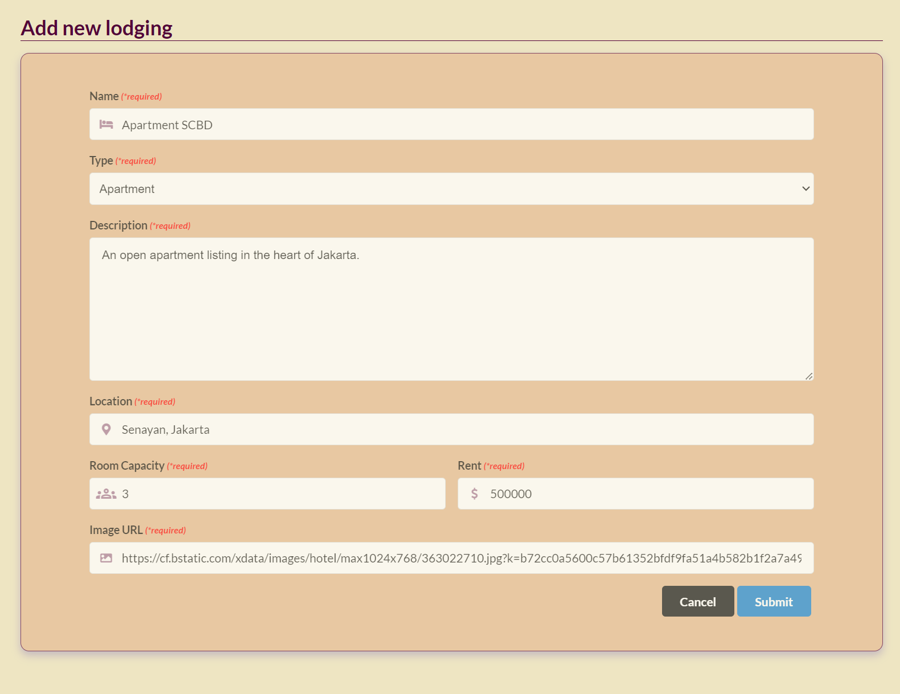
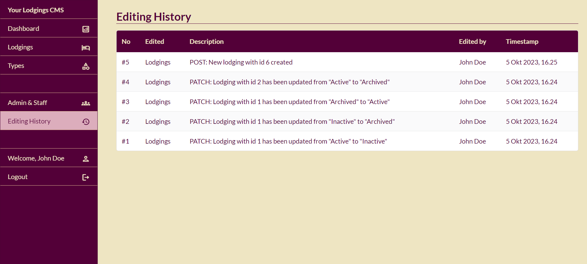

# Lodgings App

A client application for a lodgings rental platform (admin Content Management System).

Tech stack:
 - Vue.js
 - Semantic UI (CSS Library)
 - Axios
 - Vue Toast Notification

Main features:
 - OAuth user authentication
 - Admin Dashboard
 - Create, Read, Update, and Delete lodging entities
 - Show editing history of admin/staff
 - CSS & layouting: Responsive Design

## Demo Screenshots

### Admin Dashboard

### Read Entities

### Create Entities

### Show editing history
